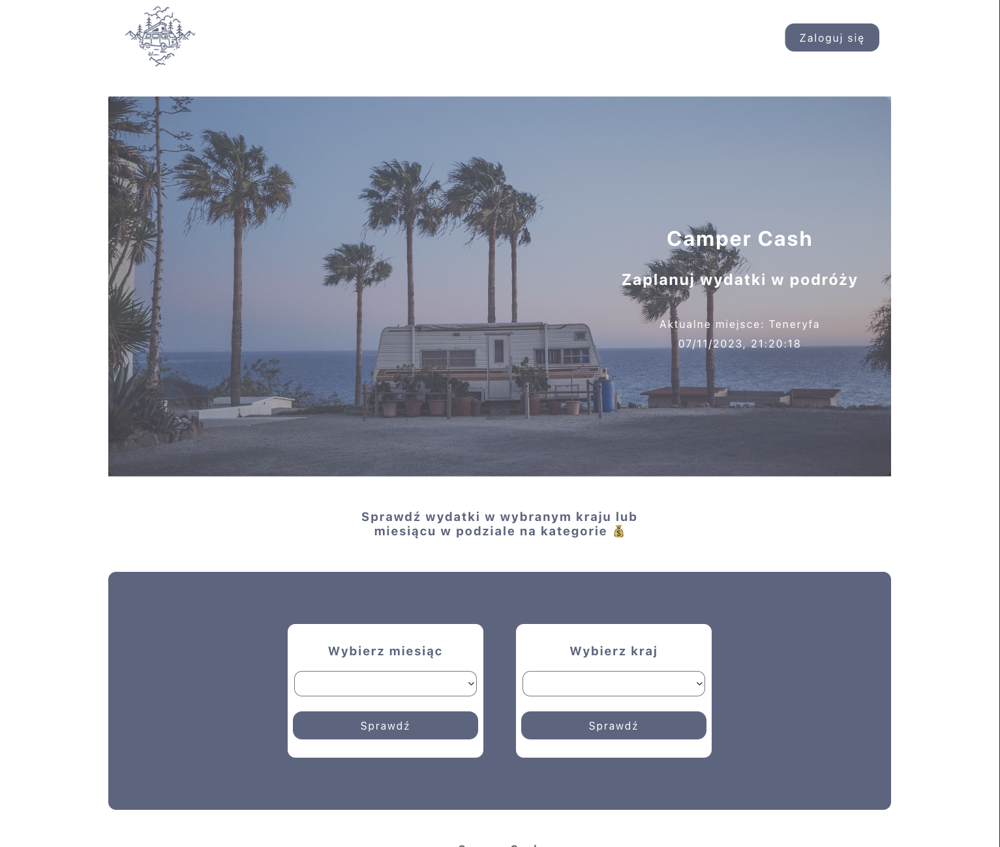
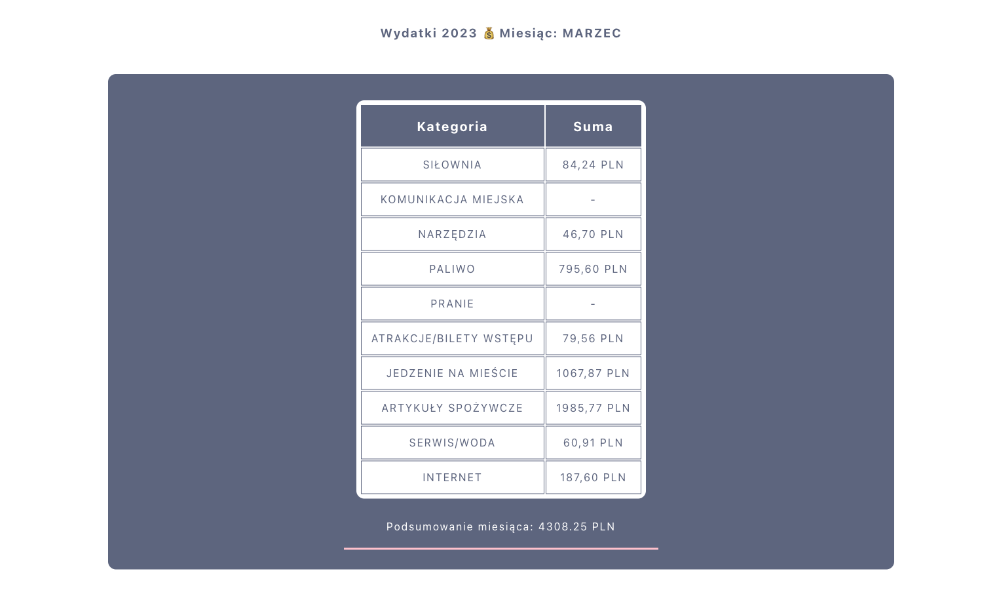
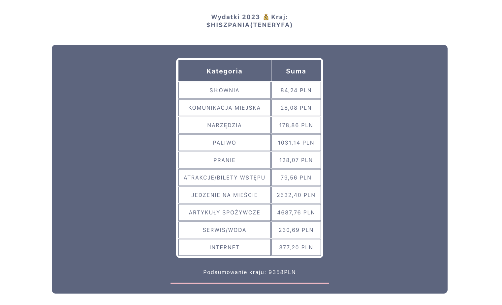
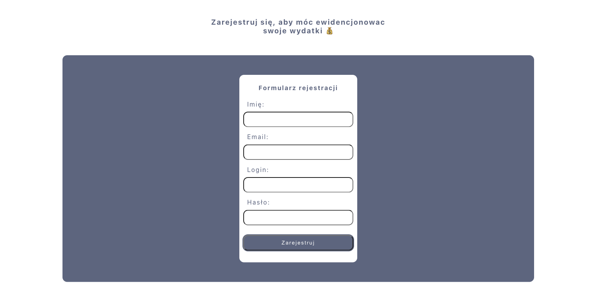
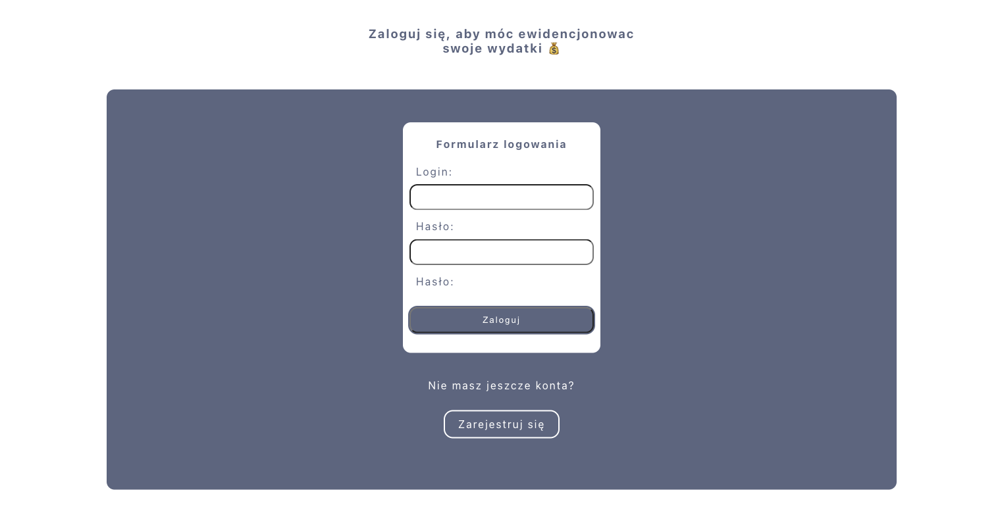
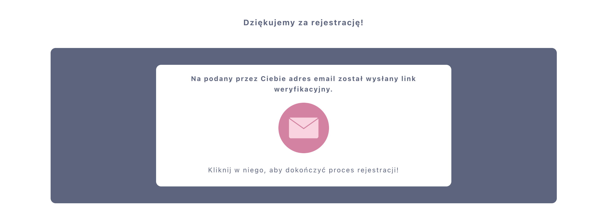
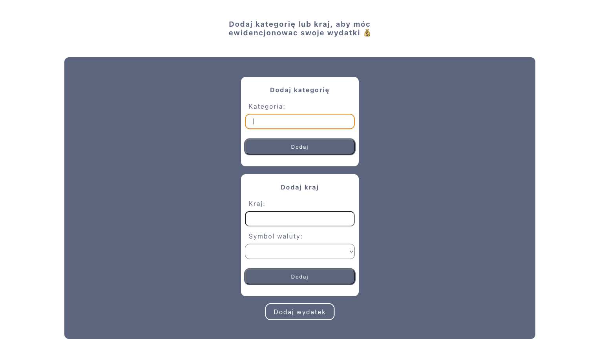
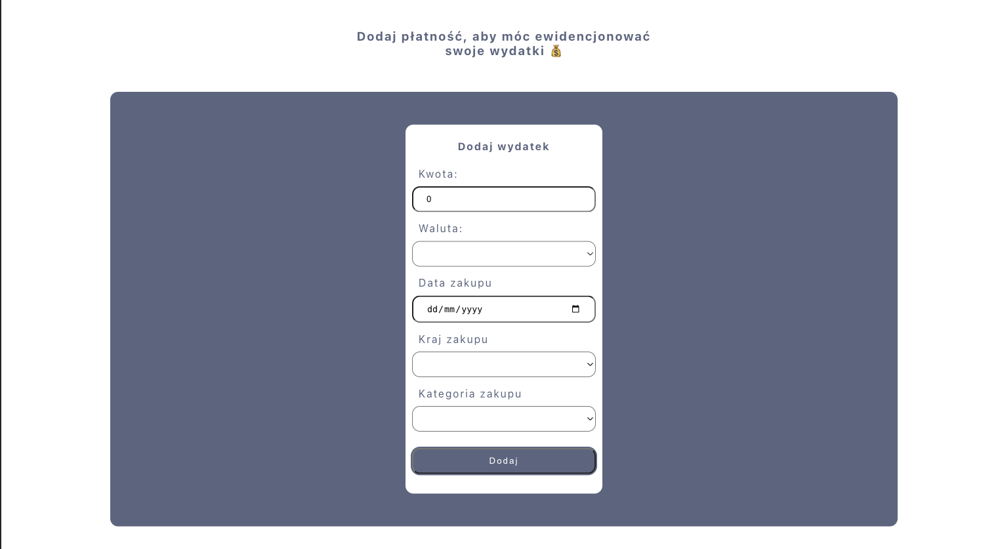

# Project Camper Frontend 🚐
This is the second version of the frontend for project camper.
The first version is here: https://github.com/designByMilencja/Project-Camper-Frontend
This is my individual project for Mega Kurs. The idea and code is my creation.
Link to a working project https://projectcamper.networkmanager.pl/
## Table of Contents
* [General info](#general-info)
* [Screenshots](#screenshots)

* [Features](#features)
* [Technologies used](#technologies-used)
* [Usage](#usage)
* [Contact](#contact)

## General Info

The main purpose of my application is to record my daily expenses during travelling by camper van. On the basis of costs shown in different countries and over different months, users will be able to plan their travel budget. In the future, I want to make the app available to users so that they can also use it when travelling and collate their expenses.

## Screenshots

## Features
- [x] the user has the option to select the country or month in which they can check expenses
- [x] the month and country view displays the categories available in the database, their totals and a summary of the entire month and a special component makes it possible to convert the calculated value in a foreign currency to take the appropriate amount on a trip
- [x] simple registration and login for the admin
- [x] the logged-in admin can add the category and country and then the expenses to the database
- [ ] does not yet have updating and deleting facilities
- [ ] currently users use the application passively; in the future, thanks to the implementation of users tables linked by foreign keys to other tables (userId), they will be able to record their expenses.

## Technologies Used
      

## Usage
### Available Scripts

In the project directory, you can run:

#### `npm start`

Runs the app in the development mode.\
Open [http://localhost:3000](http://localhost:3000) to view it in the browser.

The page will reload if you make edits.\
You will also see any lint errors in the console.

#### `npm test`

Launches the test runner in the interactive watch mode.\
See the section about [running tests](https://facebook.github.io/create-react-app/docs/running-tests) for more information.

#### `npm run build`

Builds the app for production to the `build` folder.\
It correctly bundles React in production mode and optimizes the build for the best performance.

The build is minified and the filenames include the hashes.\
Your app is ready to be deployed!

## Contact
Created by desingByMilencja - feel free to contact me!
designbymilencja@gmail.com
